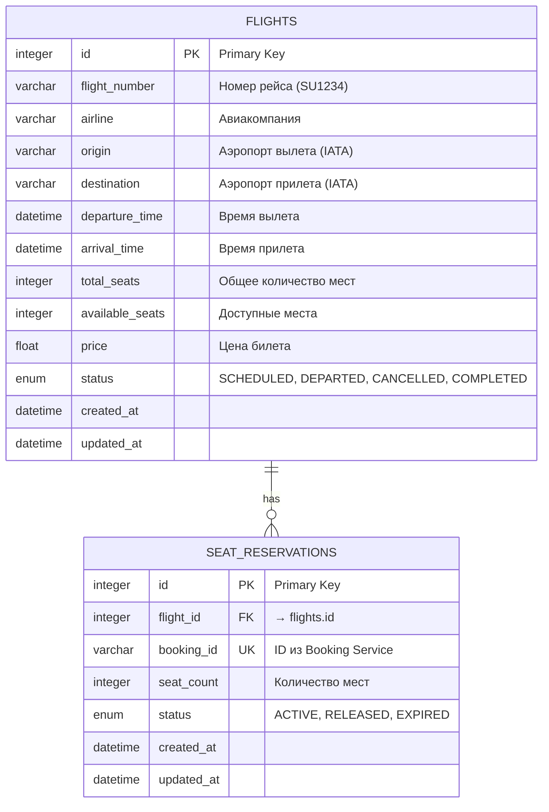
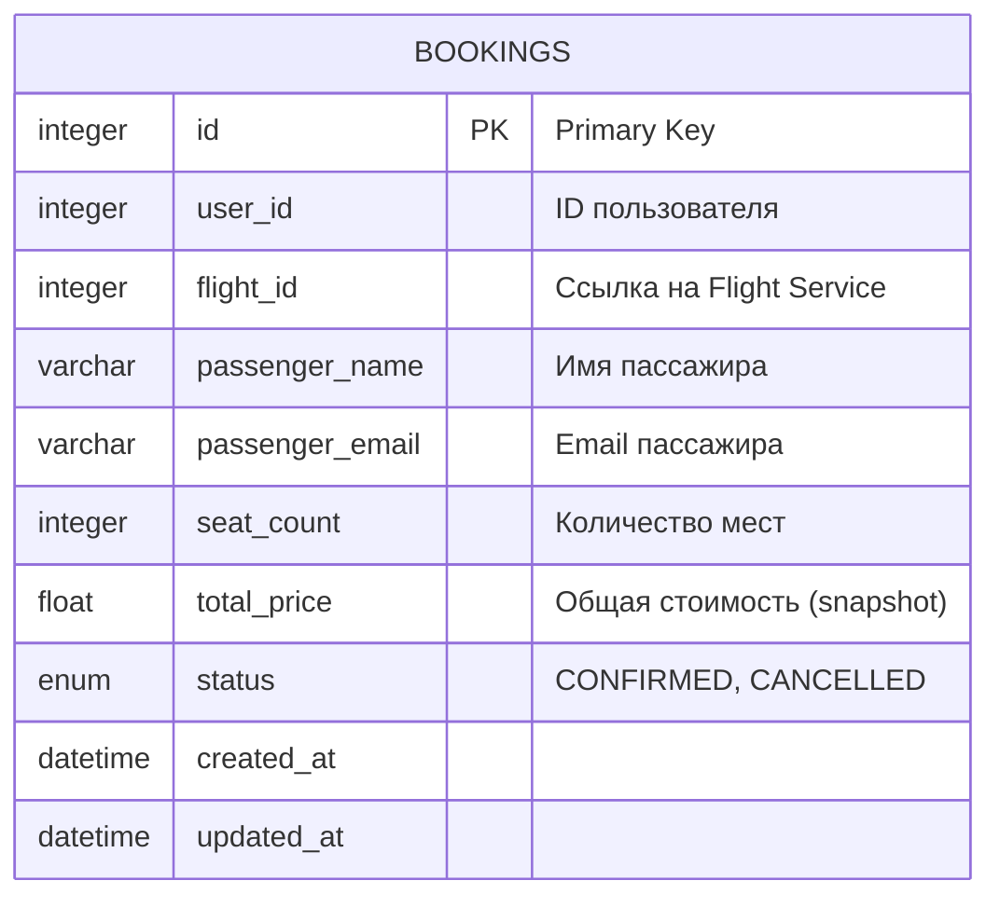
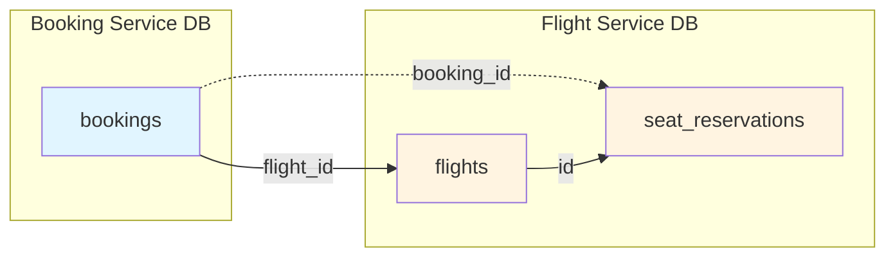
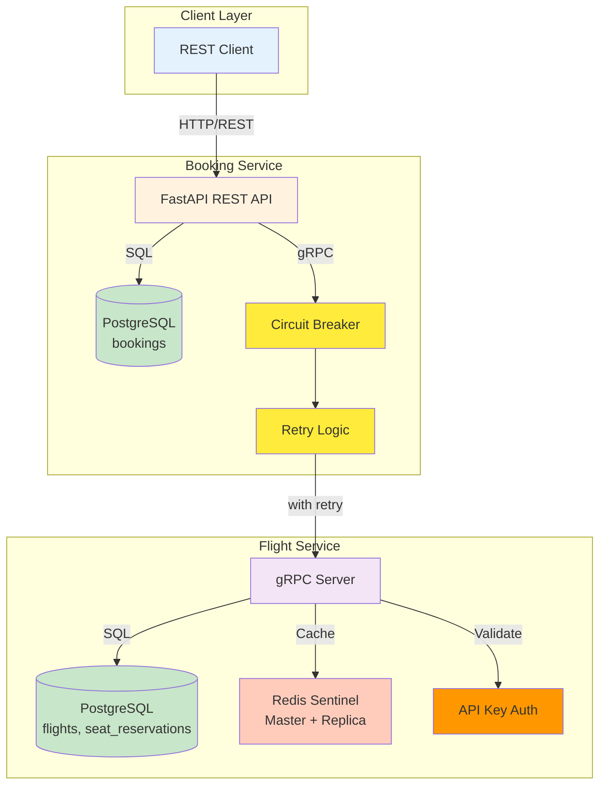
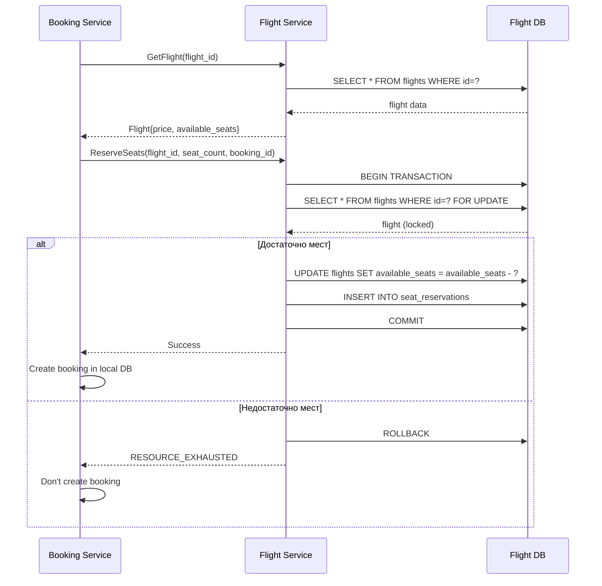
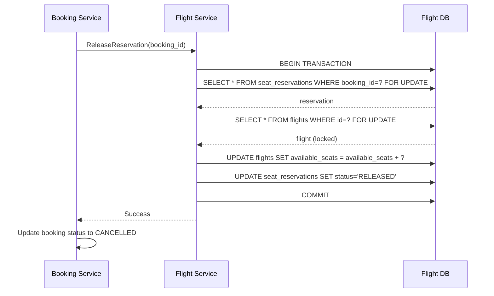
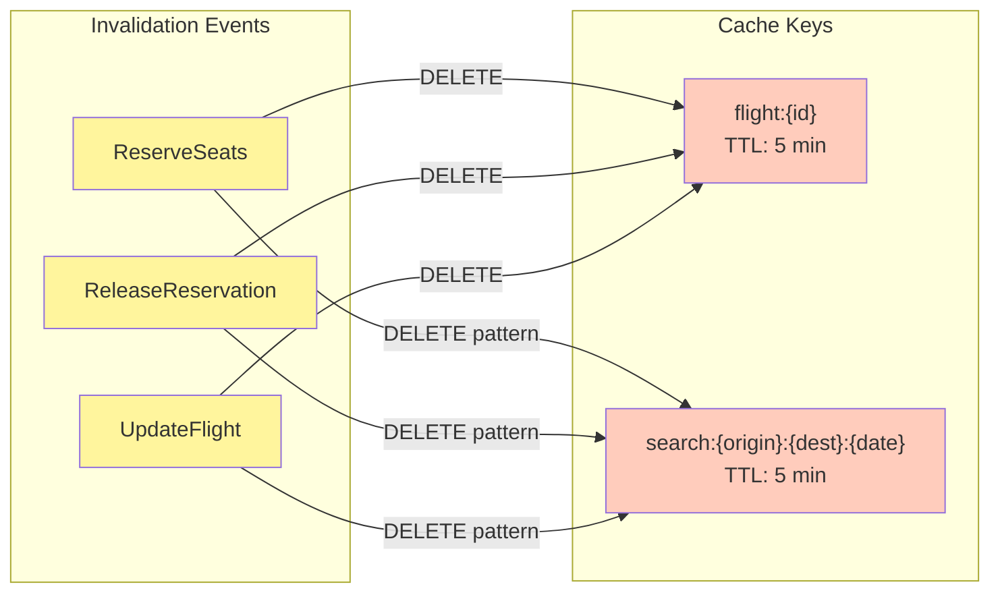

# ER-диаграмма Flight Booking System (Визуальная)

---

## Flight Service Database



## Booking Service Database



## Связи между сервисами



## Полная архитектура системы



## Constraints (Ограничения целостности)

### flights
```sql
-- Положительные значения
CHECK (total_seats > 0)
CHECK (available_seats >= 0)
CHECK (price > 0)

-- Логические ограничения
CHECK (available_seats <= total_seats)
CHECK (arrival_time > departure_time)

-- Уникальность
UNIQUE (flight_number, departure_time)
```

### seat_reservations
```sql
-- Положительные значения
CHECK (seat_count > 0)

-- Уникальность
UNIQUE (booking_id)

-- Foreign Key
FOREIGN KEY (flight_id) REFERENCES flights(id)
```

### bookings
```sql
-- Положительные значения
CHECK (seat_count > 0)
CHECK (total_price > 0)
```

## Индексы для производительности

### flights
- `id` (PRIMARY KEY)
- `flight_number` (для поиска по номеру)
- `origin` (для поиска по маршруту)
- `destination` (для поиска по маршруту)
- `departure_time` (для поиска по дате)
- `status` (для фильтрации SCHEDULED)
- `(flight_number, departure_time)` UNIQUE

### seat_reservations
- `id` (PRIMARY KEY)
- `flight_id` (для JOIN)
- `booking_id` UNIQUE (для быстрого поиска)
- `status` (для фильтрации ACTIVE)

### bookings
- `id` (PRIMARY KEY)
- `user_id` (для списка бронирований пользователя)
- `flight_id` (для связи с рейсом)
- `status` (для фильтрации)

## Нормализация (3NF)

### 1NF (Первая нормальная форма)
- Все атрибуты атомарны
- Нет повторяющихся групп
- Каждая таблица имеет первичный ключ

### 2NF (Вторая нормальная форма)
- Выполнена 1NF
- Все неключевые атрибуты полностью зависят от первичного ключа
- Нет частичных зависимостей

###  3NF (Третья нормальная форма)
- Выполнена 2NF
- Нет транзитивных зависимостей
- Все неключевые атрибуты зависят только от первичного ключа

**Пример:** В таблице `bookings` поле `total_price` - это snapshot цены на момент бронирования, а не вычисляемое значение. Это предотвращает транзитивную зависимость через `flight_id → price`.

## Транзакционные сценарии

### Создание бронирования (с SELECT FOR UPDATE)



### Отмена бронирования



## Кеширование (Redis)


