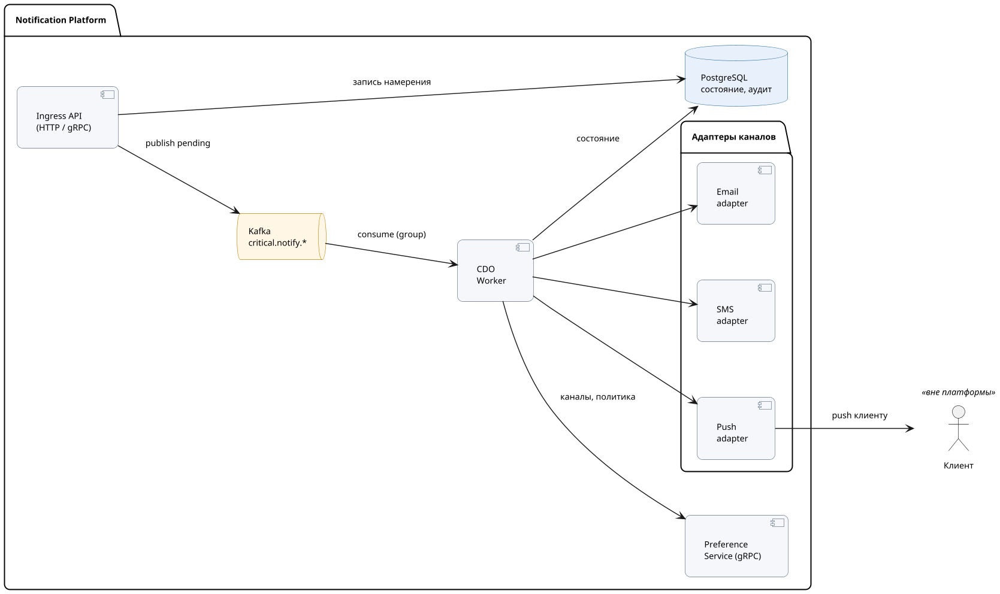
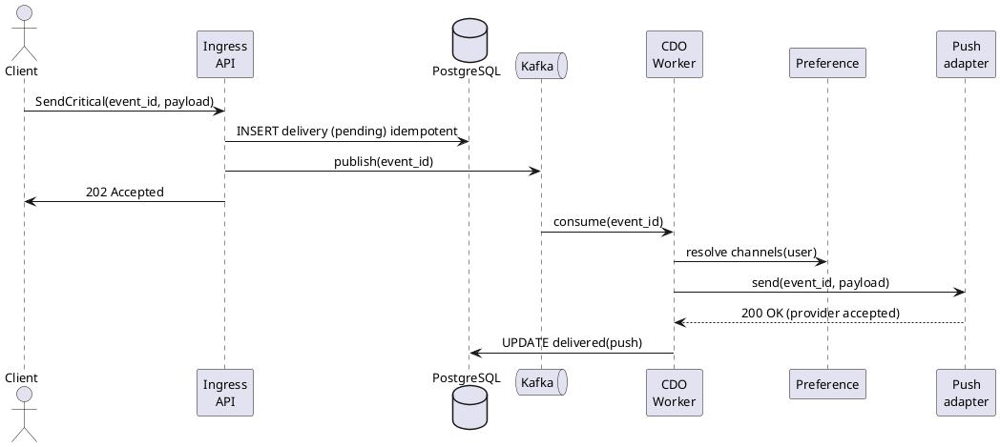
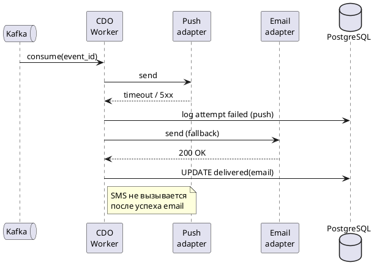
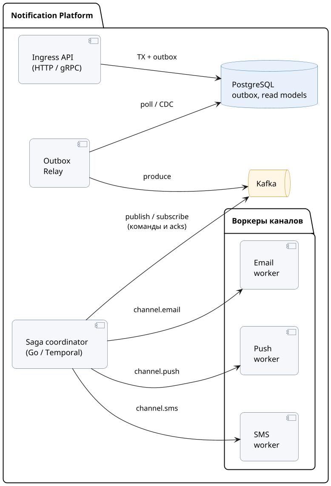
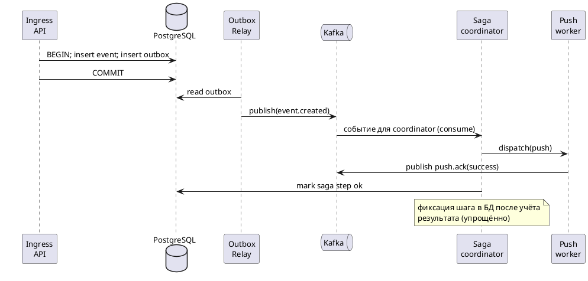
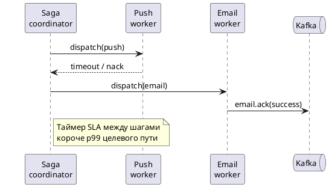

# Домашнее задание №4. Централизованная платформа уведомлений

---

## 1. Функциональные требования

**FR-1.** Система доставляет пользователю уведомления о критичных операциях (перевод, списание и т.п.) с задержкой, приемлемой для контроля движения средств и своевременного обнаружения подозрительных операций.

**FR-2.** Пользователь настраивает каналы и категории для **некритичных** уведомлений (сервисные, маркетинговые); критичные транзакционные и обязательные по регламенту банка остаются доступными для доставки независимо от маркетинговых настроек.

**FR-3.** Все исходящие уведомления проходят через единую платформу с общими правилами приоритета и ограничениями частоты, что снижает дубли и несогласованность рассылок между продуктовыми командами.

**FR-4.** Для критичных уведомлений хранится **история доставки**: факты попыток, канал, результат, привязка к пользователю и событию — для поддержки, разбора жалоб и внутренних проверок.

**FR-5.** Массовые маркетинговые кампании учитывают согласия и настройки пользователя и **не должны** снижать приоритет или задерживать транзакционные уведомления для тех же пользователей (в соответствии с целями по жалобам и удержанию).

---

## 2. Нефункциональные требования

**NFR-1. Скорость (транзакционные):** от момента, когда платформа приняла запрос, до первой успешной отправки в канал — в обычном режиме **медиана ≤ 1 с**, **99% запросов ≤ 5 с** (показатели p50 и p99).

**NFR-2. Нагрузка:** в пик система выдерживает **минимум в 5 раз больше** сообщений, чем в среднем за сутки, и при этом транзакционные уведомления всё ещё укладываются в NFR-1.

**NFR-3. Доступность приёма:** API, куда сервисы отправляют уведомления, работает **не менее 99,95% времени в месяц** (не считая заранее оговоренных остановок на обслуживание).

**NFR-4. Дубли:** жалобы из-за **одного и того же события, пришедшего дважды**, — **на 30% меньше**, чем сейчас (цель из задания); считать по обращениям в поддержку или по меткам в тикетах.

**NFR-5. Критичная доставка:** критичные транзакционные уведомления в итоге доставляются **хотя бы одним разрешённым каналом** (детализация в RFC). Доля потерянных критичных событий — **менее 0,01% в месяц** при учёте повторов и восстановления.

---

## 3. Архитектурно значимые требования (ASR)

### ASR-1: Низкая задержка транзакционного контура

**Связанные требования:** FR-1; NFR-1, NFR-2.

**Почему влияет на архитектуру:** длинные синхронные цепочки и общая очередь с маркетингом ухудшают время отклика. Нужны выделенный путь для транзакционных сообщений, приоритеты и минимизация блокирующих зависимостей при маршрутизации.

### ASR-2: Гарантированная доставка при отказах каналов (failover)

**Связанные требования:** FR-1, FR-4; NFR-5.

**Почему влияет на архитектуру:** требуется хранить состояние попыток, политику повторов и **переключение на резервный канал**; недостаточно разовой отправки во внешний API без учёта ошибок провайдера.

### ASR-3: Разделение критичного и массового трафика

**Связанные требования:** FR-3, FR-5; NFR-2.

**Почему влияет на архитектуру:** маркетинговые волны (до миллионов получателей) при общей очереди могут задерживать транзакционные сообщения; нужны изоляция очередей или квоты, приоритеты и отдельные группы обработчиков.

### ASR-4: Единые правила настроек и политик доставки

**Связанные требования:** FR-2, FR-4.

**Почему влияет на архитектуру:** настройки пользователя и ограничения по категориям должны применяться централизованно при маршрутизации и failover; иначе разные сервисы будут по-разному трактовать отписки — растут дубли и расхождения с политикой.

---

## 4. Ключевые архитектурные вопросы

### Вопрос 4.1: Как обеспечить отсутствие потери критичных событий между внутренними сервисами и каналами доставки?

**Порождают:** ASR-2, NFR-5, FR-4.

**Важность:** нужна согласованная модель «запись намерения доставить → фиксация результата у провайдера»; без неё нельзя восстановить состояние после сбоев и подтвердить факт доставки.

### Вопрос 4.2: Где провести границу между синхронным приёмом запроса и асинхронной доставкой в канал?

**Порождают:** ASR-1, NFR-1, NFR-3.

**Важность:** полная синхронная доставка до SMS/email ухудшает время отклика при сбоях провайдеров; полностью асинхронная схема без надёжной записи задачи увеличивает риск потери. Типичный компромисс — гарантированная запись на платформе и асинхронная доставка с семантикой **at-least-once** до провайдера.

### Вопрос 4.3: Как снизить дубли при повторах и failover без отказа от гарантий доставки?

**Порождают:** FR-3, NFR-4, ASR-2.

**Важность:** повторы повышают надёжность, но увеличивают риск дублирования для пользователя; нужны **идемпотентность по идентификатору бизнес-события** и правила, исключающие повторную отправку того же критичного содержимого как независимого сообщения в другой канал.

---

## 5. Архитектурные последствия ASR

| ASR | Последствия для архитектуры |
|-----|-------------|
| ASR-1 | Отдельная высокоприоритетная очередь или топик; умеренные таймауты на внешние вызовы; горизонтально масштабируемые обработчики без общего состояния; кэш предпочтений у маршрутизации. |
| ASR-2 | Персистентное хранение попыток доставки; идемпотентные адаптеры каналов; сценарии повтора и перехода на резервный канал; учёт частичного успеха. |
| ASR-3 | Раздельные конвейеры для транзакционных, сервисных и маркетинговых уведомлений; ограничение скорости (rate limiting) и обратное давление при перегрузке; приоритет планирования воркеров. |
| ASR-4 | Централизованный компонент настроек и политик; при необходимости версионирование правил; аудит применённой политики к сообщению. |

---

## 6. Архитектурные решения, которые не подходят

### 6.1. Прямые синхронные вызовы SMS/email из каждого банковского сервиса

**Нарушает:** ASR-2, ASR-3, NFR-3 (косвенно), FR-3.

**Почему:** нет единой модели приоритетов и настроек; растут дубли и расхождения; деградация провайдера может блокировать или сильно замедлять основной сценарий в продукте.

### 6.2. Одна общая FIFO-очередь для всех типов уведомлений без приоритетов

**Нарушает:** ASR-1, ASR-3, NFR-1.

**Почему:** массовые и сервисные рассылки заполняют очередь; транзакционные сообщения оказываются в хвосте, растут задержки и p99 для критичного трафика.

---

## 7. Неопределённости и архитектурные риски

### 7.1. Регуляторные требования к обязательным каналам по продуктам и регионам

**Неизвестно:** полный перечень случаев, когда отказ от SMS в пользу только push недопустим.

**Как проверить:** согласование матрицы «тип события × канал × регион» с юридической службой; пилот в ограниченном контуре с контролем жалоб и замечаний комплаенса.

### 7.2. Коррелированные отказы внешних провайдеров

**Неизвестно:** частота одновременной недоступности нескольких каналов для одного пользователя (например push и SMS).

**Как проверить:** накопление метрик доступности по каналам за несколько месяцев; тесты с имитацией отказов; уточнение порядка резервных каналов и лимитов повторов.

---

## 8. RFC: Гарантированная доставка критичных (транзакционных) уведомлений с автоматическим failover между каналами
---

### Оглавление

1. [Контекст](#контекст)
2. [Продуктовый анализ](#продуктовый-анализ)
3. [Пользовательские сценарии](#пользовательские-сценарии)
4. [Статистика](#статистика)
5. [Требования](#требования)
6. [Варианты решения](#варианты-решения)
7. [Сравнительный анализ](#сравнительный-анализ)
8. [Выводы](#выводы)
9. [Связанные задачи](#связанные-задачи)
10. [Приложения](#приложения)

---

### Контекст

Критичные транзакционные уведомления (подтверждение перевода, списание и т.д.) должны быть доставлены пользователю **хотя бы одним каналом**. Каналы (push, SMS, email) различаются по стоимости, задержке и надёжности; внешние провайдеры могут быть временно недоступны. Сейчас без единой подсистемы сложно гарантировать доставку, контролировать failover и избегать дублей при повторах.

**Ключевые вопросы**

- **Какую проблему решаем?** единый контролируемый контур критичной доставки с резервными каналами и аудитом.
- **Почему важно сейчас?** бизнес-цели: удержание пользователей, снижение жалоб, гарантия доставки важных сообщений (см. разделы 1–3 основного документа).
- **Кто затронут?** клиенты банка (получатели), продуктовые команды (отправители), поддержка и комплаенс (разбор инцидентов), эксплуатация платформы.

**Цели RFC (подсистема CDO — Critical Delivery Orchestrator):**

- доставка критичного события в разрешённый канал с семантикой **at-least-once** до провайдера;
- **автоматический failover** при ошибке или таймауте;
- снижение дублирования критичного UX при failover (**идемпотентность** по `event_id`);
- **наблюдаемость** (логи, метрики, трассировка);
- **минимизация SMS** (дорогой канал) при сохранении гарантий.

**Нецели RFC:** строгая exactly-once видимость во всех каналах одновременно; доставка маркетинговых кампаний.

Пользователь может задавать предпочтения по каналам; **полное отключение критичных событий не допускается** — только порядок разрешённых каналов и резервы по политике банка.

---

### Продуктовый анализ

| Цель из постановки | Как закрывает подсистема CDO |
|--------------------|------------------------------|
| Retention +15% | своевременные и доверительные уведомления о движении средств |
| −30% жалоб на уведомления | меньше «потерянных» критичных и меньше лишних дублей при failover |
| Гарантированная доставка критичных | at-least-once до провайдера, учёт попыток, резервные каналы |

Риски: рост стоимости при чрезмерном SMS; необходимость согласования обязательных каналов с юридической службой по регионам.

---

### Пользовательские сценарии

| Приоритет | Тип сценария | Действующее лицо | Сценарий |
|-----------|--------------|------------------|----------|
| MUST HAVE | Успешная доставка | Клиент | После операции пользователь получает критичное уведомление в выбранный основной канал (например push) без заметной задержки. |
| MUST HAVE | Failover | Клиент / платформа | Основной канал недоступен или таймаут — система автоматически пробует следующий разрешённый канал (например email), без второго независимого «критичного» дубля того же события. |
| MUST HAVE | Аудит | Сотрудник поддержки | По обращению клиента видно цепочку попыток, каналы и итог по `event_id`. |
| SHOULD HAVE | Настройки | Клиент | Пользователь задаёт порядок каналов в рамках политики; критичные события нельзя отключить полностью. |
| COULD HAVE | Операции | SRE | По метрикам видно долю failover, задержки p99 и стоимость на событие. |

**Приоритеты:** MUST HAVE — обязательно; SHOULD HAVE — желательно; COULD HAVE — при наличии ресурсов.

---

### Статистика

**Входные данные (из задания):** MAU 10M, DAU 3M, пик одновременных пользователей 300k; в среднем **2** транзакционных уведомления на пользователя в день.

| Показатель | Оценка (порядок величин) |
|------------|--------------------------|
| Сообщений в сутки (критичные) | DAU × 2 ≈ **6×10⁶** |
| Средний RPS | ≈ **70** |
| Пиковый RPS (вечер, зарплатные дни) | ≈ **1,5–3,5 тыс.**, проектный запас **~5 тыс./с** |
| Вызовы адаптеров при failover/повторах | до **~2–3×** от успешного пути → суммарно до **~10⁴ вызовов/с** при горизонтальном масштабировании |

**Вывод для ёмкости:** горизонтальное масштабирование воркеров CDO, партиционирование очереди/топика по ключу события.

---

### Требования

#### Функциональные требования

| № | Приоритет | Обозначение | Требование |
|---|-----------|-------------|------------|
| 1 | MUST HAVE | FR-RFC-1 | Подсистема принимает критичное уведомление с глобально уникальным `event_id`. |
| 2 | MUST HAVE | FR-RFC-2 | Формируется упорядоченный список каналов по политике банка, настройкам пользователя и минимизации стоимости. |
| 3 | MUST HAVE | FR-RFC-3 | Попытки доставки выполняются последовательно до успеха или исчерпания каналов/лимитов повторов. |
| 4 | MUST HAVE | FR-RFC-4 | Каждая попытка и результат фиксируются для аудита и поддержки. |
| 5 | MUST HAVE | FR-RFC-5 | После успеха в одном канале то же критичное содержимое не дублируется в следующем как отдельное критичное уведомление. |

#### Нефункциональные требования

| № | Приоритет | Обозначение | Требование |
|---|-----------|-------------|------------|
| 1 | MUST HAVE | NF-RFC-1 | В штатном режиме: время от постановки в обработку до первой успешной отправки **p99 ≤ 5 с** (согласовано с NFR-1 документа). |
| 2 | MUST HAVE | NF-RFC-2 | Доля потерянных критичных событий **< 0,01% в месяц** (NFR-5). |
| 3 | MUST HAVE | NF-RFC-3 | Сквозная трассировка: `trace_id` от Ingress API до адаптера провайдера. |
| 4 | MUST HAVE | NF-RFC-4 | Наблюдаемость: логирование, метрики, трейсинг по критичному контуру. |

**Расчёт нагрузок** (дублирует раздел «Статистика» для соответствия шаблону):

```
Критичные сообщения/сутки ≈ 6e6  →  RPS_avg ≈ 70
Пиковый RPS ≈ (20–50) × RPS_avg  →  порядка 1.5e3–3.5e3, запас до ~5e3 на контур CDO
С учётом failover: вызовы к адаптерам до ~1e4/s суммарно (несколько инстансов воркеров)
```

#### Архитектурно значимые требования подсистемы (ASR)

| Приоритет | ID | Суть |
|-----------|-----|------|
| P0 | ASR-RFC-A | Идемпотентность и отсутствие дублирующего критичного UX при failover |
| P0 | ASR-RFC-B | Устойчивость к отказам каналов (failover) |
| P1 | ASR-RFC-C | Стоимость: предпочтение push относительно SMS |
| P1 | ASR-RFC-D | Соблюдение целевой задержки (p99) |

---

### Варианты решения

#### Вариант 1: Оркестрация воркером (машина состояний + Kafka)

**Описание:** запись намерения и состояния в **PostgreSQL**, публикация в **Kafka** (`critical.notify.pending`), обработка **CDO Worker** с последовательными попытками по каналам; адаптеры push/SMS/email по gRPC.

##### Архитектура

После приёма запроса Ingress API сохраняет запись о доставке, публикует событие в Kafka. Воркер для каждого `event_id` выполняет цепочку: основной канал → таймаут/ошибка → следующий канал. Успех фиксируется в БД; опционально публикация в `critical.notify.completed`.

**Технологии:** Apache Kafka, PostgreSQL, gRPC, Redis (кэш настроек), OpenTelemetry, Kubernetes.

**Соответствие ASR:** ASR-RFC-A — уникальность `(event_id, channel, attempt_no)`, дедуп в Redis; ASR-RFC-B — таймауты, backoff, переход на резерв; ASR-RFC-C — порядок push → email → SMS; ASR-RFC-D — выделенный пул воркеров, короткие таймауты адаптеров.

###### Диаграмма C4 (Container), вариант 1



###### Sequence: основной сценарий (вариант 1)



###### Sequence: failover (вариант 1)



##### Этапы реализации

| Этап | Описание | Планируемый срок | Ресурсы | Риски |
|------|----------|------------------|---------|-------|
| 1 | Ingress + PostgreSQL + push + аудит | [TBD] | backend 2 FTE | Неверная модель idempotency |
| 2 | Kafka + CDO Worker + email failover | [TBD] | +1 FTE | Задержки при пике записи в БД |
| 3 | SMS как резерв + метрики + хаос-тесты | [TBD] | +QA | Стоимость SMS при инцидентах |

##### Преимущества

- Понятная модель состояния в одной БД; проще сопровождать первую версию.
- Хороший аудит и трассировка при линейном сценарии воркера.

##### Недостатки

- PostgreSQL может стать узким местом при экстремальном пике записи (нужны партиции/шарды).
- Меньше гибкости, чем у полноценной саги, при очень сложных многошаговых правилах.

---

#### Вариант 2: Transactional outbox + координатор саги

**Описание:** Ingress API пишет в PostgreSQL через **transactional outbox**; **Outbox Relay** публикует в Kafka; **Saga Coordinator** (или Temporal) рассылает команды по топикам каналов; воркеры каналов исполняют идемпотентно; ack в `channel.ack`; при таймауте — следующий канал.

##### Архитектура

Разделение ответственности: приём транзакции и outbox, ретрансляция в брокер, оркестрация шагов саги, независимые воркеры на push/email/SMS.

**Технологии:** Kafka, PostgreSQL + outbox, опционально Temporal.io, Redis, OpenTelemetry.

**Соответствие ASR:** то же по смыслу, что в варианте 1; сильнее выражено независимое масштабирование исполнителей по каналам.

###### Диаграмма C4 (Container), вариант 2



###### Sequence: основной сценарий (вариант 2)



###### Sequence: failover (вариант 2)



##### Этапы реализации

| Этап | Описание | Планируемый срок | Ресурсы | Риски |
|------|----------|------------------|---------|-------|
| 1 | Outbox + relay + базовая сага + push | [TBD] | backend 2–3 FTE | Сложность отладки распределённой саги |
| 2 | Независимые воркеры email/SMS + идемпотентность | [TBD] | +1 FTE | Дубли при ошибках координации |
| 3 | Наблюдаемость, SLO, нагрузочные тесты | [TBD] | SRE + QA | Операционная нагрузка |

##### Преимущества

- Независимое масштабирование воркеров по каналам.
- Удобная эволюция при росте числа шагов и таймеров в саге.

##### Недостатки

- Больше компонентов и выше порог владения для команды.
- Выше риск дублей без строгой дисциплины идемпотентности по `event_id`.

---

### Сравнительный анализ

#### Ресурсные требования

| Критерий | Вариант 1 (воркер + Kafka) | Вариант 2 (outbox + сага) |
|----------|----------------------------|---------------------------|
| Время реализации | Обычно короче для MVP | Дольше из-за координатора и большего числа сервисов |
| Команда | 2 backend + 1 SRE (оценка) | 3 backend + 1 SRE (оценка) |
| Инфраструктура | Kafka, PostgreSQL, Redis, K8s | То же + опционально Temporal |
| Организационные риски | Ниже порог входа | Выше требования к эксплуатации саги |

#### Соответствие требованиям

Оба варианта **в принципе** могут выполнить те же FR/NFR: это не «вариант 1 да / вариант 2 нет», а **разная цена** (число компонентов, типичные узкие места, риск ошибки в реализации). Ниже — не дублирующие галочки, а **где чаще упирается реализация**.

| Требование | Где упирается вариант 1 | Где упирается вариант 2 |
|------------|-------------------------|-------------------------|
| FR-RFC (доставка, failover, журнал) | Модель таблиц в PostgreSQL и логика одного воркера | Согласованность outbox → Kafka → шаги саги и нескольких воркеров |
| NF-RFC-1 (p99) | Пик записи/чтения в БД и задержка воркера | Задержка координатора и лишние сетевые переходы между сервисами |
| NF-RFC-2 (потери) | Надёжность очереди и ретраев из БД | Надёжность саги (таймеры, ack, повтор шагов) |
| NF-RFC-3 (trace_id) | Один контур проще протянуть end-to-end | Больше хопов — важнее единый стандарт трассировки между сервисами |
| NF-RFC-4 (observability) | Меньше сервисов — проще дашборды | Больше сервисов — больше точек, где метрики должны сходиться |

| Критерий качества | Вариант 1 | Вариант 2 |
|-------------------|-----------|-----------|
| Простота эксплуатации | Выше | Ниже |
| Гибкость сложных сценариев | Достаточно для старта | Выше при росте шагов саги |
| Риск дублей | Ниже при простой модели состояния | Выше без дисциплины идемпотентности |

---

### Выводы

**Рекомендация:** для первой версии подсистемы критичной доставки выбрать **вариант 1** (CDO Worker + Kafka + PostgreSQL).

**Обоснование:** ниже операционная сложность и быстрее вывод в прод при сохранении соответствия FR/NFR и ASR; состояние в одной БД упрощает аудит. **Вариант 2** оставить как путь развития при усложнении сценариев (много шагов, жёсткие требования к независимому масштабированию каналов).

**Принятые компромиссы и ограничения:**

- семантика **at-least-once** до провайдера: возможны повторы на границе сети — идемпотентные ключи на адаптерах;
- SMS — после исчерпания более дешёвых каналов; лимиты SMS на пользователя/сутки;
- обязательные метрики: `delivery_latency_p99`, `failover_rate`, `cost_per_event`, `duplicate_suppressed_count`.

---

### Связанные задачи

| ID | Описание (плейсхолдер) |
|----|-------------------------|
| NP-CDO-1 | Реализация Ingress API + схема PostgreSQL для доставок |
| NP-CDO-2 | Топики Kafka и CDO Worker, сценарий failover |
| NP-CDO-3 | Адаптеры каналов + SLO с провайдерами |
| NP-CDO-4 | Дашборды метрик и алерты по критичному контуру |

### Приложения

#### Глоссарий

| Термин | Определение |
|--------|-------------|
| **Ingress API** | Точка входа в Notification Platform: внутренние сервисы банка вызывают его, чтобы поставить уведомление в очередь (принять запрос, записать намерение доставить). Не путать с входом пользователя в приложение. |
| **CDO** (Critical Delivery Orchestrator) | Подсистема оркестрации критичной доставки: очередь, порядок каналов, failover, журнал попыток. **CDO Worker** — процесс, обрабатывающий сообщения из Kafka и вызывающий адаптеры каналов. |
| **Failover** | Переход на резервный канал при ошибке или таймауте основного. |
| **Outbox** | Паттерн transactional outbox: событие записывается в БД в одной транзакции с бизнес-данными, затем ретранслируется в брокер. |
| **`event_id`** | Идентификатор бизнес-события для идемпотентности и аудита. |
| **p99** | 99-й перцентиль задержки: не более 1% запросов медленнее порога. |

---


